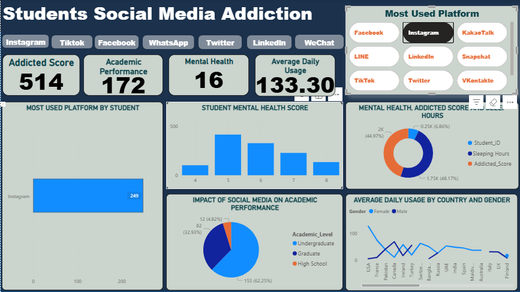

# 📊 Students Social Media Addiction Analysis

This repository presents a comprehensive data analysis project focused on understanding the impact of social media usage on students' academic performance, mental health, and daily routines.

## 🔍 Project Overview

The increasing reliance on social media among students raises concerns about its effects on key aspects of student life. This project explores these effects using visual data representations and statistical analysis. The data was visualized using dashboards that examine usage patterns across platforms, countries, and genders.

---

## 📁 Dataset Overview

The dataset includes the following key attributes:
- **Student ID**
- **Platform Usage**
- **Addicted Score**
- **Average Daily Usage**
- **Academic Performance**
- **Mental Health Score**
- **Sleep Hours**
- **Gender**
- **Country**
- **Academic Level**

---

## 📈 Visualizations & Insights

### 1. Main Dashboard


- **Addicted Score:** 2227
- **Average Daily Usage:** 4.70 hours
- **Academic Performance Score:** 453
- **Mental Health Score:** 149

---

### 2. Most Used Platform by Students


Instagram, TikTok, and Facebook dominate usage. Instagram is used by 249 students — the highest.

---

### 3. Student Mental Health Score Distribution


Most students report a mental health score between 5 and 7, indicating moderate stress levels.

---

### 4. Mental Health, Addicted Score and Sleep Hours


Donut chart reveals:
- **47.93%** of records are related to addiction score.
- **45.09%** are linked to sleep hours.

---

### 5. Average Daily Usage by Country and Gender


- India and the USA show the highest average usage.
- Female students tend to use social media slightly more than males.

---

### 6. Slicer (Interactive Filtering View)



Allows filtering of the dashboard based on gender, country, academic level, and platform for deeper insights.

---

## 🧠 Key Takeaways

- Excessive social media use correlates with lower academic performance and reduced sleep.
- Instagram and TikTok are the most engaging platforms.
- Female students, on average, use social media more than males.
- Undergraduates and high school students are the most affected groups.

---

## 🛠️ Tools Used

- **Microsoft Power BI** – Data visualization
- **Excel / CSV** – Data cleaning and formatting
- *(Optional for extension)* **Python / Streamlit** – For future interactive dashboards

---

## 📂 Repository Structure

```bash
📁 Social-Media-Addiction-Analysis/
│
├── social media addidction.png
├── Most Used Platform.png
├── Student Mental Health Score.png
├── Mental Health, Addicted Score and Sleep Hours.png
├── Average Daily Usage by Country And Gender.png
├── Slicer.png
├── README.md
